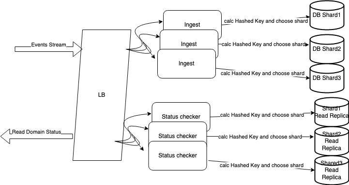

# Overview

given the service scalability requirements, specifically on the massive amount events that need to be ingested I was faced with two options as datastores when it came to the design, my initial thought was this seems like an analytical service, lets keep the service layer simple but open for horizontal scale and leverage a datastore capabilities to support the huge amount of writes.

## Constraints

* ingests about 200k events per second
* needs to scale to about 60% YoY
* scales to handle 100k events per second across 10M domain
* P95 latency 200 ms
* works on top of HTTP
* datastores are limited to (MongoDB, Cassandra, Postgres)

## Assumptions

* events are ordered FIFO
* status can be derived near real time.
* querying domain status needs to be instant.
* data retention is indefinite.

## Approach

My approach is simple, simple ingestion processor behind http endpoints,
leveraging Golang http concurrent nature where each request handler runs in its own goroutine, I don't need extra internal [Fan-In](https://go.dev/blog/pipelines) operation.
By Implementing a simple counter in the datastore, incremented for each event type per domain, that way I kept the ingestion layer light for horizontal scale, but moved the scalability bottlenecks to the datastore.
I assumed that storing events log history can be delegated else where, I can only focus on counting events for each domain to reduce the amount of writes.

## Challenges

### Which datastore is the right choice (Postgres vs Mongodb)?

the service is write heavy, so I need a datastore that can scale and adapt to the scale with time.

* My first approach was to choose Postgres ( I haven't considered Cassandra), given the [benchmarks](https://www.enterprisedb.com/news/new-benchmarks-show-postgres-dominating-mongodb-varied-workloads), PG beats MongoDB across writes and reads with more solid features when it comes to native support for transactions and being fully ACID complaint, the major drawback is it does not support [sharding natively](https://postgrespro.com/blog/pgsql/5969681), while it supports partitioning but its a master only write so keeping it fault tolerant is [tricky](https://www.alibabacloud.com/blog/solution-to-ensure-availability-and-reliability-rporto-of-postgresql-two-node-stream-replication_598027).

* My choice depends on MongoDB, it offers sharding with write capability on the sharded replica, that way I can scale up the ingestion nodes as the number of events grow without worrying about the datastore not scaling accordingly, using [Hashed Sharding](https://www.mongodb.com/docs/manual/core/hashed-sharding/).
the drawbacks is the load balancer needs to recognize and route events based on the sharded key implementation), also using [PSS](https://www.mongodb.com/docs/manual/core/replica-set-architecture-three-members/#primary-with-two-secondary-members--p-s-s-) replication for each shard to ensure fault tolerance.
The way the keys are sharded early on will make huge difference on how the system will scale.

* deploying two sets of the service, a set responsible for ingestion and other set for reading domain status.

### optimizations

* using [hashed index](https://www.mongodb.com/docs/manual/indexes/#hashed-indexes), keys will be domain names, compatible with Hashed sharding.
* since status can be NRT, the ingestion service can fan in a number of events in an internal queue then store them in a single [transaction](https://www.mongodb.com/docs/manual/core/transactions/).
* caching the domain status once its `not catch-all` in a near memory cache like redis can speed up domain checks.

### How can we make this better?

#### events

* event types, event name should be explicit enough, adding a type does not tell me what is this event unless I open it, parse it then do whatever logic.
* events should carry at least one timestamp representing when this event was sourced.
* events should carry one unique key to ensure integrity, its hard for the service to determine if it processed this event before or not.

#### medium

* Restful is bad for streaming its built on top of HTTP/1.1, I'd recommend for the service we can use gRPC it supports streaming and offers great multiplexing features.
* The less the payload size the better, alternative for json a good replacement would be Thrift, Avro or Protobuf.
* the service can have serve two interfaces ( its a matter of adding a command similar `serve-http`).
* if I had the choice I'd choose a different NoSQL datastore, Redis could be very good candidate (although retention could be a problem from memory size prospective), other solution could be DynamoDB takes the hassle of sharding and replication away with its magic (although it could be more expensive) .
* another solution could be using a [materialized Kafka topics](https://mail-narayank.medium.com/stream-aggregation-in-kafka-e57aff20d8ad) where all events are directly streamed to Kafka, sharded properly and distributed among multiple topics, with a small service layer to wrap the domain status querying logic
